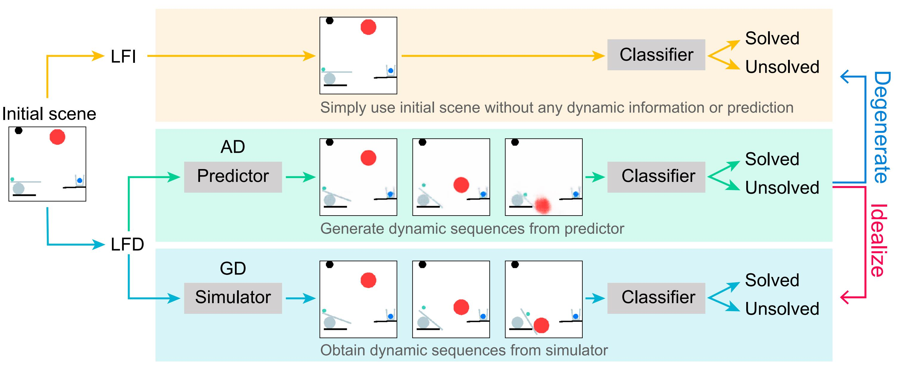

**[NeurIPS 2022 conference]
On the Learning Mechanisms in Physical Reasoning**

<small>Shiqian Li\*, Kewen Wu\*, Chi Zhang, Yixin Zhu.[October, 2022]</small>

Abstract
-

Is dynamics prediction indispensable for physical reasoning? If so, what kind of roles do the dynamics prediction modules play during the physical reasoning process? Most studies focus on designing dynamics prediction networks and treating physical reasoning as a downstream task without investigating the questions above, taking for granted that the designed dynamics prediction would undoubtedly help the reasoning process. In this work, we take a closer look at this assumption, exploring this fundamental hypothesis by comparing two learning mechanisms: Learning from Dynamics (LfD) and Learning from Intuition (LfI). 

In the **first experiment**, we directly examine and compare these two mechanisms. Results show a surprising finding: Simple LfI is better than or on par with state-of-the-art LfD. This observation leads to the **second experiment** with Ground-truth Dynamics (GD), the ideal case of LfD wherein dynamics are obtained directly from a simulator. Results show that dynamics, if directly given instead of approximated, would achieve much higher performance than LfI alone on physical reasoning; this essentially serves as the performance upper bound. Yet practically, LfD mechanism can only predict Approximate Dynamics (AD) using dynamics learning modules that mimic the physical laws, making the following downstream physical reasoning modules degenerate into the LfI paradigm; see the **third experiment**. We note that this issue is hard to mitigate, as dynamics prediction errors inevitably accumulate in the long horizon. Finally, in the **fourth experiment**, we note that LfI, the extremely simpler strategy when done right, is more effective in learning to solve physical reasoning problems. Taken together, the results on the challenging benchmark of PHYRE show that LfI is, if not better, as good as LfD with bells and whistles for dynamics prediction. However, the potential improvement from LfD, though challenging, remains lucrative.

**citation**: *Li S, Wu K, Zhang C, et al. On the Learning Mechanisms in Physical Reasoning[J]. arXiv preprint arXiv:2210.02075, 2022.*

[website](https://lishiqianhugh.github.io/LfID_Page/)

[Download paper here](https://arxiv.org/pdf/2210.02075.pdf)

